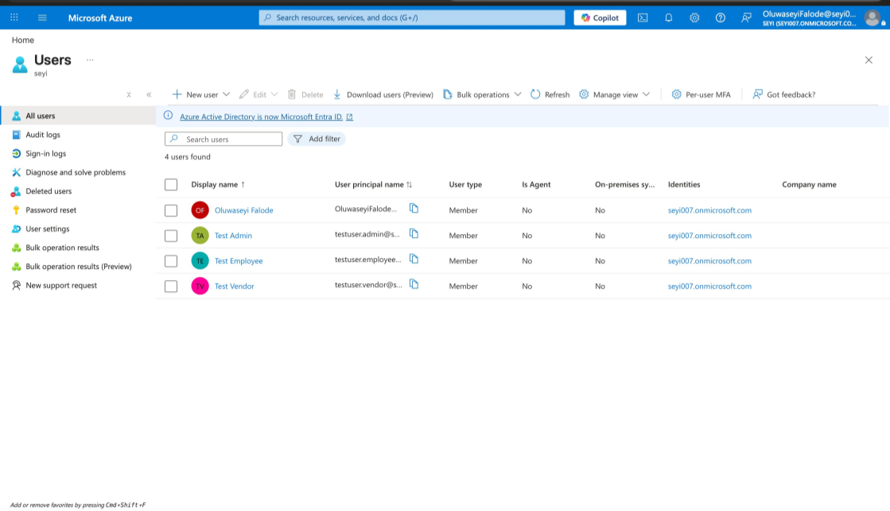
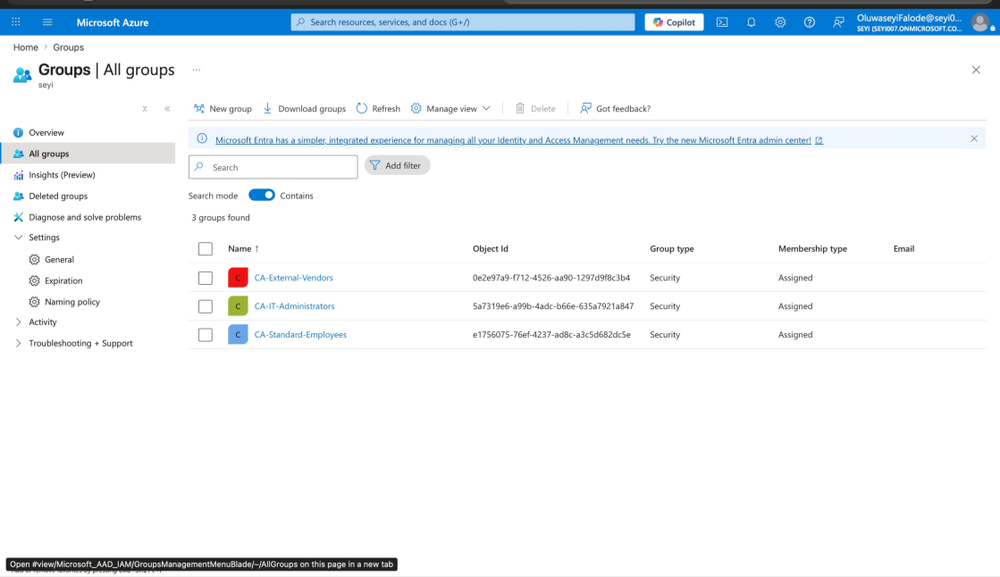
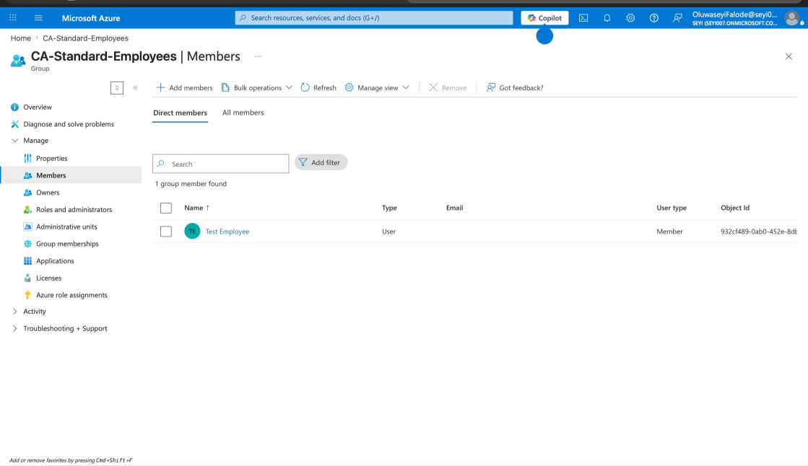
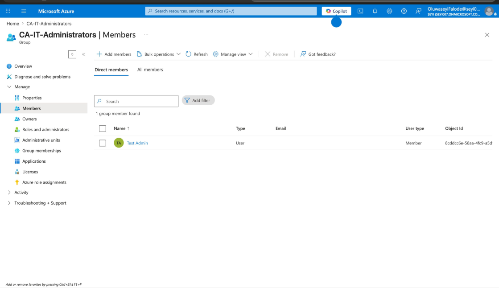
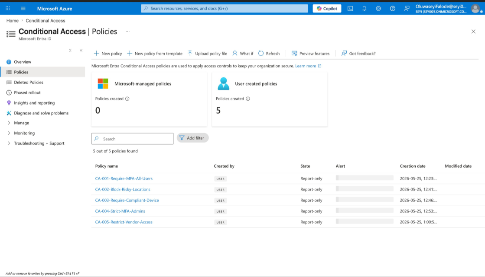
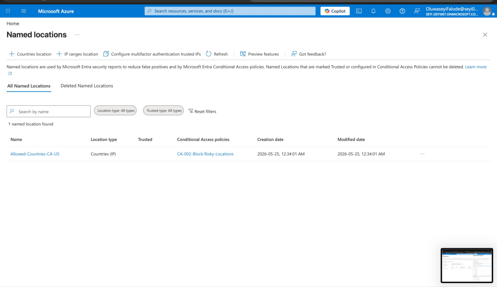
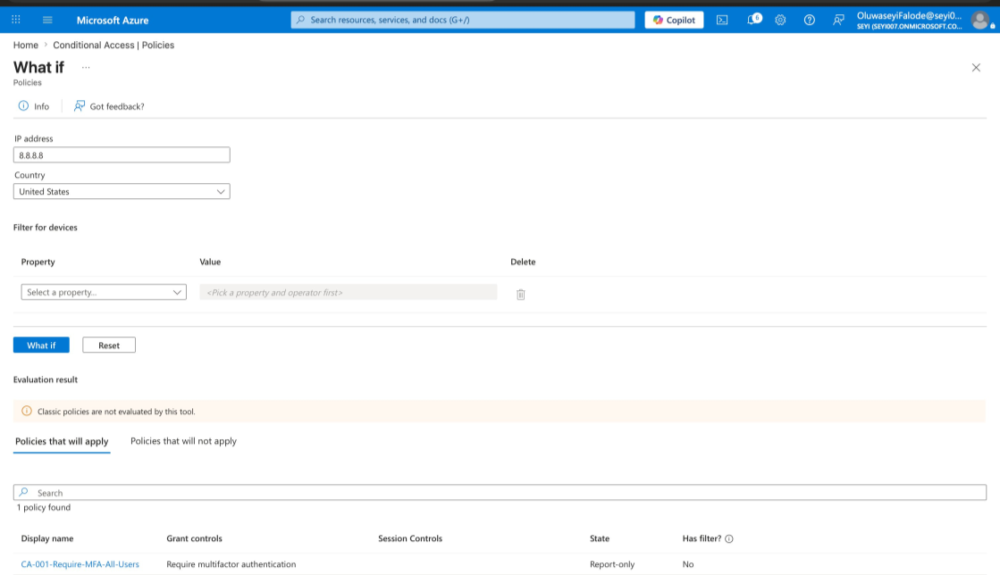
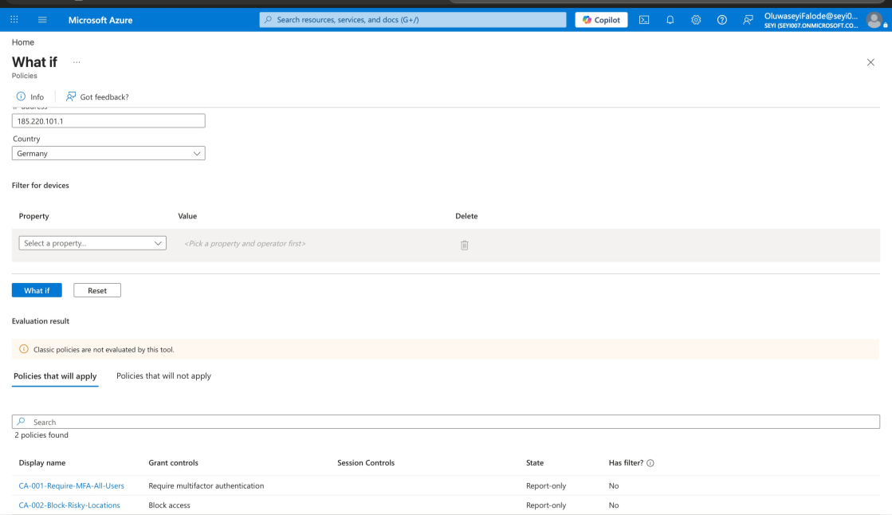

# Entra ID Conditional Access Lab

**Enterprise Identity Security Framework — Microsoft Entra ID Premium P2**  
Oluwaseyi Michael Falode | Cybersecurity & Cloud Security Engineer | Toronto, ON | May 2026


---

A complete Conditional Access policy framework designed, deployed, and validated from scratch using Microsoft Entra ID Premium P2. Five policies covering the core security scenarios a regulated financial institution would enforce — standard employees, IT administrators, and external vendors. Every policy was deployed in Report-only mode following enterprise change management best practices and validated using the built-in What If analysis tool before any enforcement.

## Project at a Glance

| | |
|---|---|
| **Platform** | Microsoft Azure · Microsoft Entra ID |
| **License** | Microsoft Entra ID Premium P2 |
| **Policies Built** | 5 Conditional Access policies |
| **Policy Mode** | Report-only (pre-enforcement validation) |
| **User Personas** | Standard Employee · IT Administrator · External Vendor |
| **Security Groups** | CA-Standard-Employees · CA-IT-Administrators · CA-External-Vendors |
| **Security Focus** | Identity security · Zero Trust · MFA enforcement · Geo-blocking · Privileged access |
| **Frameworks** | Zero Trust Architecture · Principle of Least Privilege · Enterprise Change Management |

## The Problem This Project Solves

Identity is the new perimeter. In a cloud-first enterprise, there is no longer a physical network boundary protecting internal systems — every login is a potential attack surface. Microsoft research shows that over 99% of account compromise attacks are blocked by MFA alone. Yet most breaches still succeed because access controls are either absent, misconfigured, or applied inconsistently across different user risk profiles.

A financial institution like Scotiabank faces three distinct threats simultaneously:

- **Threat 1 — Account takeover at scale:** Standard employees log into dozens of cloud applications every day. Without MFA enforced across all apps, a single phishing email is enough to hand an attacker full access.
- **Threat 2 — Credential use from foreign regions:** Stolen credentials sold on dark web markets are used by attackers in other countries. A bank operating in Canada and the Americas has no legitimate reason to allow logins from unrelated geographic regions. Without geo-blocking, a valid credential is all an attacker needs.
- **Threat 3 — Privileged account compromise:** Admin accounts can modify security settings, create users, grant permissions, and access everything. A compromised admin account is a full organizational breach. Standard controls are not enough for accounts at this privilege level.

Conditional Access is Microsoft Entra's policy engine for enforcing adaptive access controls. This lab demonstrates how to design, deploy, and validate a production-grade CA framework that addresses all three threats across all three user risk profiles — in Report-only mode, with What If validation, before any enforcement touches a live user.

## Identity Structure

Three security groups were created to segment users by role and risk level. Conditional Access policies target groups because this is the only approach that scales in an enterprise environment — you define the rule once and it applies to every current and future member of that group automatically.

| Group | Member | Purpose |
|---|---|---|
| CA-Standard-Employees | Test Employee | Standard staff with everyday app access |
| CA-IT-Administrators | Test Admin | Privileged accounts with elevated system access |
| CA-External-Vendors | Test Vendor | External contractors with limited app access |

### Test Users Created



*Figure 1 — All three test user accounts representing the three user personas*

### Security Groups



*Figure 2 — Three security groups with Assigned membership type, each targeting a different risk profile*



*Figure 3 — CA-Standard-Employees group with Test Employee as direct member*



*Figure 4 — CA-IT-Administrators group with Test Admin as direct member*

## Policies Deployed

### CA-001 — Require MFA for All Users

| | |
|---|---|
| **Scope** | All users → All cloud apps |
| **Access Control** | Require multifactor authentication |

MFA is the single most effective control against account takeover. Every user accessing any company application must verify their identity with a second factor — no exceptions, no exclusions.

---

### CA-002 — Block Risky Locations

| | |
|---|---|
| **Scope** | All users → All cloud apps → Any network or location |
| **Exclusion** | Allowed-Countries-CA-US (Canada and United States) |
| **Access Control** | Block access |

Login attempts from countries outside approved regions are blocked completely before authentication begins. Stolen credentials used by attackers in foreign countries are stopped at the location layer before any credential check occurs.

---

### CA-003 — Require Compliant Device for Admin Portals

| | |
|---|---|
| **Scope** | All users → Microsoft Admin Portals |
| **Access Control** | Require device to be marked as compliant |

Admin portals are the highest value targets in any organization. Only devices enrolled in Microsoft Intune and verified as meeting security standards can access these portals. An attacker with stolen admin credentials and an unmanaged device gets nothing.

---

### CA-004 — Strict MFA for Admin Accounts

| | |
|---|---|
| **Scope** | CA-IT-Administrators → All cloud apps (Sign-in risk: Low, Medium, High) |
| **Access Control** | Require multifactor authentication |

Admin accounts are the primary target of attackers. This policy challenges admin accounts at every risk level with zero exceptions. CA-001 already covers all users — CA-004 adds an explicit, separate policy for admin accounts so that administrative identities can be monitored, audited, and tightened independently.

---

### CA-005 — Restrict Vendor Access

| | |
|---|---|
| **Scope** | CA-External-Vendors → Office 365 only |
| **Access Control** | Require multifactor authentication |

Vendors are external parties with no business need to access Azure portals, admin consoles, or sensitive financial systems. Scoping their access to Office 365 only means a compromised vendor account cannot reach anything beyond email and collaboration tools. Principle of least privilege applied at the application layer.

---

### All 5 Policies — Report-only Mode



*Figure 5 — All 5 Conditional Access policies active in Report-only mode on the Entra dashboard*

## Named Locations

A named location defined the approved geographic boundary referenced in CA-002.

| Location Name | Type | Countries | Used In |
|---|---|---|---|
| Allowed-Countries-CA-US | Countries (IP) | Canada, United States | CA-002 — Block Risky Locations |



*Figure 6 — Allowed-Countries-CA-US named location using country-based IP geolocation*

## What If Validation Results

All policies were validated using the Entra What If tool before enabling enforcement. This is the enterprise standard for pre-deployment CA policy testing.

### Test 1 — US Login (Allowed with MFA)

**Scenario:** Test Employee logs in from IP `8.8.8.8` (United States)

| Policy | Result |
|---|---|
| CA-001 — Require MFA | Applied — MFA required |
| CA-002 — Block Risky Locations | Not applied — US is in the allowed countries list |

**Outcome:** Login proceeds after MFA. Location exclusion working correctly.



*Figure 7 — What If result: US login triggers MFA only — location policy excluded correctly*

---

### Test 2 — Germany Login (Blocked)

**Scenario:** Test Employee logs in from IP `185.220.101.1` (Germany)

| Policy | Result |
|---|---|
| CA-001 — Require MFA | Applied |
| CA-002 — Block Risky Locations | Applied — access blocked |

**Outcome:** Login completely blocked. Both policies fire. In a live environment this login never completes regardless of credential validity.



*Figure 8 — What If result: Germany login triggers both MFA and Block — access denied*

## Policy Framework Architecture

```
USER ATTEMPTS LOGIN
       |
       | Entra ID evaluates all Conditional Access policies
       v
CA-002 — LOCATION CHECK
  ├── Login from Canada or US? → Continue
  └── Login from any other country? → BLOCKED immediately

       |
       | location passed
       v
CA-001 — MFA FOR ALL USERS
  └── All users, all apps → Challenge with MFA

       |
       | user is an IT administrator
       v
CA-004 — STRICT MFA FOR ADMINS
  └── CA-IT-Administrators → MFA at Low / Medium / High risk

       |
       | user accessing Microsoft Admin Portals
       v
CA-003 — COMPLIANT DEVICE CHECK
  └── All users → Admin portals → Intune-compliant device required

       |
       | user is an external vendor
       v
CA-005 — VENDOR SCOPE RESTRICTION
  └── CA-External-Vendors → Office 365 only + MFA required
```

## Key Concepts Demonstrated

- Conditional Access policy design for a regulated financial institution
- Named location configuration using country-based IP geolocation
- User segmentation using security groups for targeted, scalable policy application
- Report-only mode deployment following enterprise change management best practices
- What If tool usage for pre-enforcement policy validation
- Principle of least privilege applied at the application level for vendor accounts
- Proportional security controls — stricter access controls for higher sensitivity resources
- Zero Trust identity layer — never trust, always verify, regardless of network location

## Skills Applied

Microsoft Entra ID · Conditional Access · Identity and Access Management · Zero Trust Architecture · MFA Enforcement · Geo-blocking · Privileged Access Management · Microsoft Intune · Security Group Design · Enterprise Policy Framework

---

*Oluwaseyi Michael Falode · Cybersecurity & Cloud Security Engineer · Toronto, ON · May 2026*
